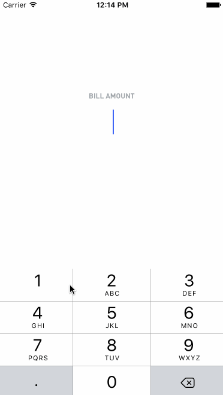

# Tips
This is an iOS application for determining tip amount and splitting a bill between individuals.

Time spent: 6 hours total

## Completed user stories: 

* [x] Required: User can enter in an amount and determine the total with tip
* [x] Required: Via a segment controller the user can change the tip percentage
* [x] Optional: Customized Colors, Fonts, and Layout
* [x] Optional: Added App Icon
* [x] Optional: Keyboard .becomeFirstResponder() at Launch
* [x] Optional: Animating the results via an animation block with custom easing
* [x] Optional: Showing the bill split difference for 1-4 persons
* [x] Optional: Added Image Assets (for the people icon)
* [x] Optional: Added Image Assets (for the people icon)

## GIF Walkthrough of User Stories

GIF created with [LiceCap](http://www.cockos.com/licecap/).

